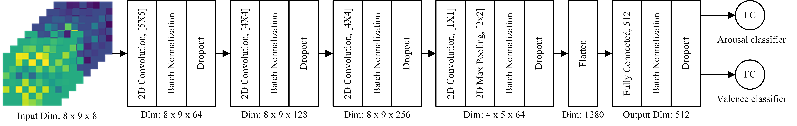
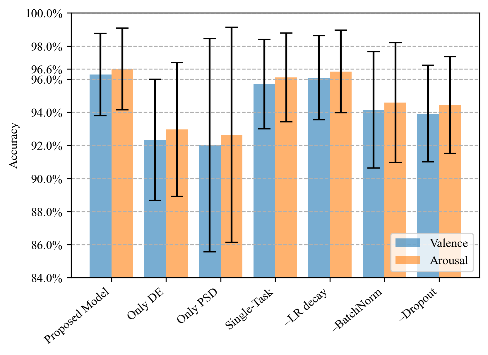
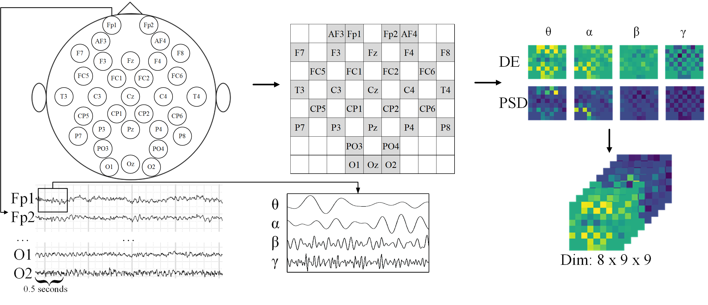

**Status:** Archived (code is provided as-is, no updates expected)

# MT-CNN for EEG Emotion Recognition
Code for the paper "Multi-Task CNN Model for Emotion Recognition from EEG Brain Maps" presented on the 4th IEEE International Conference on Bio-engineering for Smart Technologies BioSmart 2021. Keras implementation.

It describes a simple model which outperforms previous SOTA approaches in terms of accuracy on the DEAP dataset.

[Slides](https://github.com/dolphin-in-a-coma/multi-task-cnn-eeg-emotion/blob/main/MT_CNN.pdf) 
[Video](https://www.youtube.com/watch?v=86spmxqTg3k&ab_channel=EvgeniiRudakov)
[Colab](https://colab.research.google.com/github/dolphin-in-a-coma/multi-task-cnn-eeg-emotion/blob/main/Training.ipynb)
[Paper](https://www.researchgate.net/profile/Samer-Al-Kork/publication/356727064_Multi-Task_CNN_model_for_emotion_recognition_from_EEG_Brain_maps/links/61f8d7f81e98d168d7e2a94f/Multi-Task-CNN-model-for-emotion-recognition-from-EEG-Brain-maps.pdf) 

## Pros and Cons

As a subject-dependent approach, the solution nevertheless provides the framework for a unified fully 2D-CNN model for solving two tasks on the whole set of subjects without regarding the number of subjects. This approach previously led to the performance degradation because of high cross-subject variance in the data, thus in previous state-of-the-art researches the common practice was to use unique model for each task and for each subject. This problem was overcome by using a set of regularizations and training best practices.

Nevertheless, our model cannot be used for subject-independent emotion recognition, specifically if EEG signals were recorded using other EEG sensor types. When this model was used to test on subjects which weren't seen during the training step, the accuracy fell down below 60%. I didn't see in the literature any high-accurate approaches for subject-independent emotion recognition, so it's still an interesting and highly challenging task.

## Results
| Method                                                                                                                                     | DEAP Valence Accuracy | DEAP Arousal Accuracy|
|--------------------------------------------------------------------------------------------------------------------------------------------|---------------------|-------|
| [Multi-column CNN](https://www.mdpi.com/1424-8220/19/21/4736)                                                                              | 90.01%              | 90.65%|
| [SAE-LSTM](https://www.frontiersin.org/articles/10.3389/fnbot.2019.00037/full)                                                             | 81.10%              | 74.38%|
| [4D-CRNN](https://www.researchgate.net/publication/344371728_EEG-based_emotion_recognition_using_4D_convolutional_recurrent_neural_network)| 94.22%              | 94.58%|
| [FBCCNN](https://www.hindawi.com/journals/cmmm/2021/2520394/)                                                                              | 90.26%              | 88.90%|
| MT-CNN (Published method)                                                                                                                  | 96.28%              | 96.62%|
| MT-CNN (Updated method)                                                                                                                    | 98.18%              | 97.80%|

## Dataset
[DEAP dataset](https://www.eecs.qmul.ac.uk/mmv/datasets/deap/) consists of electroencephalography signals recorded from 32 participants. During the sessions participants watched 40 music videoclips and marked them in terms of valence, arousal, liking and dominance from 1 to 9. In this research we use only arousal and valence values, which was split in low and high regions to solve a classification task.

## Data preprocessing
The script is working with *.mat files that have been processed in a certain way from raw DEAP dataset. Our data processing method is mainly based on the method described in [this repository](https://github.com/shark-in-a-coma/4D-CRNN/tree/master/DEAP). There are two *.py scripts that need to be run to convert DEAP data (Tab _Preprocessed data in Matlab format (2.9GB)_ on the [DEAP website](https://www.eecs.qmul.ac.uk/mmv/datasets/deap/download.html)) into appropriate format. 

**Generating DE (differential entropy) files**

To generate files with DE features, it's first needed to run DEAP_1D.py script from the above-mentioned repository, then DEAP_1D_3D.py. Specify the path to the directory with the files and the output path in the scripts.

**Generating PSD (power spectral density) files**

To create PSD files, it's needed to run modified [DEAP_1D.py](https://github.com/shark-in-a-coma/4D-CRNN/blob/psd_generation/DEAP/DEAP_1D.py), and the same DEAP_1D_3D.py after.

To run the training script it's needed to collect all the resulting PSD_{subject_number}.mat (32 files for the DEAP dataset) and 32 DE_{subject_number}.mat (the same number) files in the dataset directory and specify path to it as a parameter. 

## Training and evaluation

All the training steps are demonstrated in [Colab Notebook](https://colab.research.google.com/github/dolphin-in-a-coma/multi-task-cnn-eeg-emotion/blob/main/Training.ipynb)
